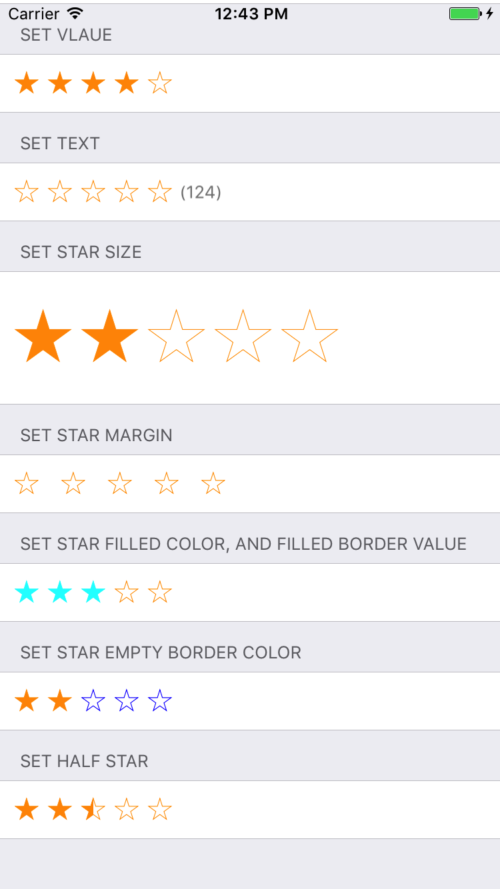

# RatingRow - Eureka

A customized rating row in [Eureka](https://github.com/xmartlabs/Eureka), based on [Cosmos - star rating control library](https://github.com/marketplacer/Cosmos)



## Install via pod

add pod in your `podfile`:

```
pod 'RatingRow'
```

and install via Cocoapods

```
pod install
```

## Usage

```swift
import UIKit
import Eureka
import RatingRow

class ViewController: FormViewController {

    override func viewDidLoad() {
        super.viewDidLoad()
        // Do any additional setup after loading the view, typically from a nib.
        
        form
            +++ Section("default")
                <<< RatingRow()
            +++ Section("set vlaue") {
                $0.footer?.height = {0}
                $0.header?.height = {20}
            }
                <<< RatingRow() {
                    $0.rating = 4
            }
            +++ Section("set text") {
                $0.footer?.height = {0}
                $0.header?.height = {20}
            }
                <<< RatingRow() {
                    $0.text = "(124)"
            }
            +++ Section("set star size") {
                $0.footer?.height = {0}
                $0.header?.height = {20}
            }
                <<< RatingRow() {
                    $0.starSize = 45
                    $0.cell.height = {100}
            }
            +++ Section("set star margin") {
                $0.footer?.height = {0}
                $0.header?.height = {20}
            }
                <<< RatingRow() {
                    $0.starMargin = 15
            }
            +++ Section("set star filled color, and filled border value") {
                $0.footer?.height = {0}
                $0.header?.height = {20}
            }
                <<< RatingRow() {
                    $0.filledColor = UIColor.cyan
                    $0.filledBorderColor = UIColor.cyan
                    $0.rating = 3
            }
            +++ Section("set star empty border color") {
                $0.footer?.height = {0}
                $0.header?.height = {20}
            }
                <<< RatingRow() {
                    $0.emptyBorderColor = UIColor.blue
                    $0.rating = 2
            }
            +++ Section("set half star") {
                $0.footer?.height = {0}
                $0.header?.height = {20}
            }
                <<< RatingRow() {
                    $0.fillMode = .half
                    $0.rating = 2.5
            }
    }

    override func didReceiveMemoryWarning() {
        super.didReceiveMemoryWarning()
        // Dispose of any resources that can be recreated.
    }
}
```

## License

MIT
